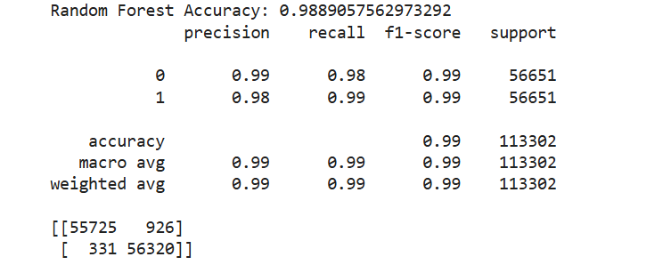

#  Credit Card Fraud Detection using Machine Learning

##   Project Overview
This project is a **Machine Learning-based Fraud Detection System** that classifies credit card transactions as:

-  Normal (0)
-  Fraud (1)

Using multiple classification algorithms, the best model is selected based on performance metrics.

##  Dataset
The dataset is too large to be uploaded on GitHub due to size limitations.

-> [Download Dataset](https://drive.google.com/file/d/1tXxuArcMPaqKBH6QfiwhF32wOy39pEFs/view?usp=sharing)

##  Machine Learning Pipeline (Step-by-Step)

### 1) Problem Definition
**Objective:** Defined the problem of credit card fraud, its impact, and the need for an automated detection system. Outlined project objectives and scope.

---

### 2) Data Collection
**Objective:** Used a credit card transaction dataset from Kaggle.
- Explored its characteristics, including transaction types (normal vs fraud) and data structure.

---

### 3) Data Cleaning & Preprocessing
**Objective:** Prepared the dataset for modeling:
- Checked for missing values  
- Removed duplicates  
- Scaled 'Amount' using RobustScaler  
- Extracted 'Hour' feature from 'Time'

---
  

### 4) Exploratory Data Analysis (EDA)
**Objective:** Analyzed dataset patterns:
- Studied class imbalance  
- Compared fraud vs normal transactions  
- Analyzed time and amount distributions  
- Checked feature correlations  

---

### 5) Feature Engineering & Selection
**Objective:** Improved model performance:
- Created 'Is_Night' and 'Amount_Log' features  
- Defined input features (X) and target variable (y)

---

### 6) Model Selection
**Objective:** Selected suitable ML models:
- Logistic Regression  
- Random Forest  
- XGBoost  
- Applied SMOTE to handle class imbalance  
- Performed train-test split  

---

### 7) Model Training
**Objective:** Trained models on processed data to learn fraud patterns.

---

### 8) Model Evaluation & Tuning
**Objective:** Evaluated models using:
- Accuracy  
- Precision  
- Recall (important for fraud detection)  
- F1-score  
- Confusion Matrix  

Performed hyperparameter tuning using GridSearchCV (Random Forest).

---

### 9) Model Deployment
**Objective:** Prepared the best model for use:
- Saved trained model  
- Created prediction function for new transactions
  
    Prediction Output
  
  

---
  

### 10) Monitoring & Maintenance
**Objective:** Ensured long-term performance:
- Monitor model performance  
- Detect data drift  
- Retrain model when needed
  
---
  

##  Best Model Performance

###  Random Forest (Tuned Model)
-  Accuracy: **0.99**
-  Recall (Fraud): **0.99**
-  Lowest Errors: **1257**

 Selected as final production model
 

##  Tech Stack
- Python 
- Pandas & NumPy
- Scikit-learn
- XGBoost
- SMOTE
- Matplotlib & Seaborn
- Joblib

##  Future Improvements
- Real-time fraud detection API
- Deep learning models
- Flask / FastAPI deployment
- Continuous learning system

##  Author: Saman Tarique
Credit Card Fraud Detection Project using Machine Learning
